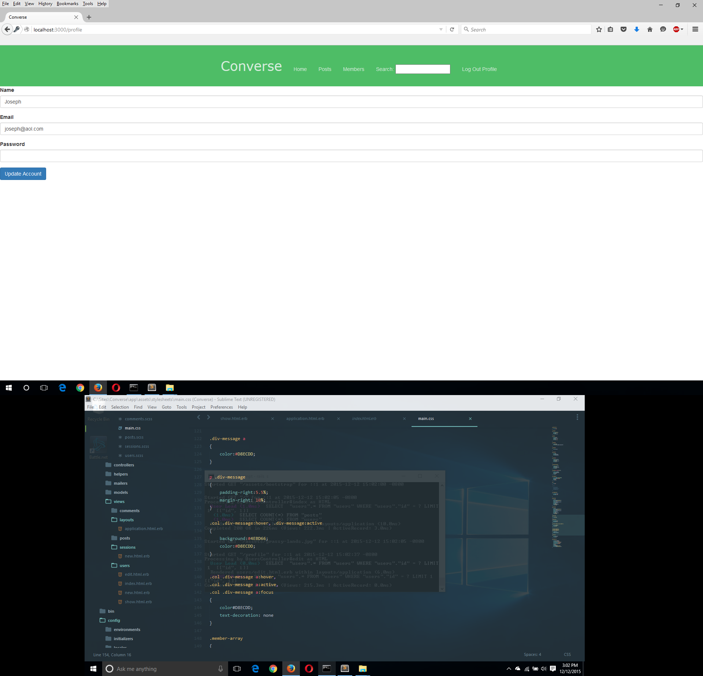
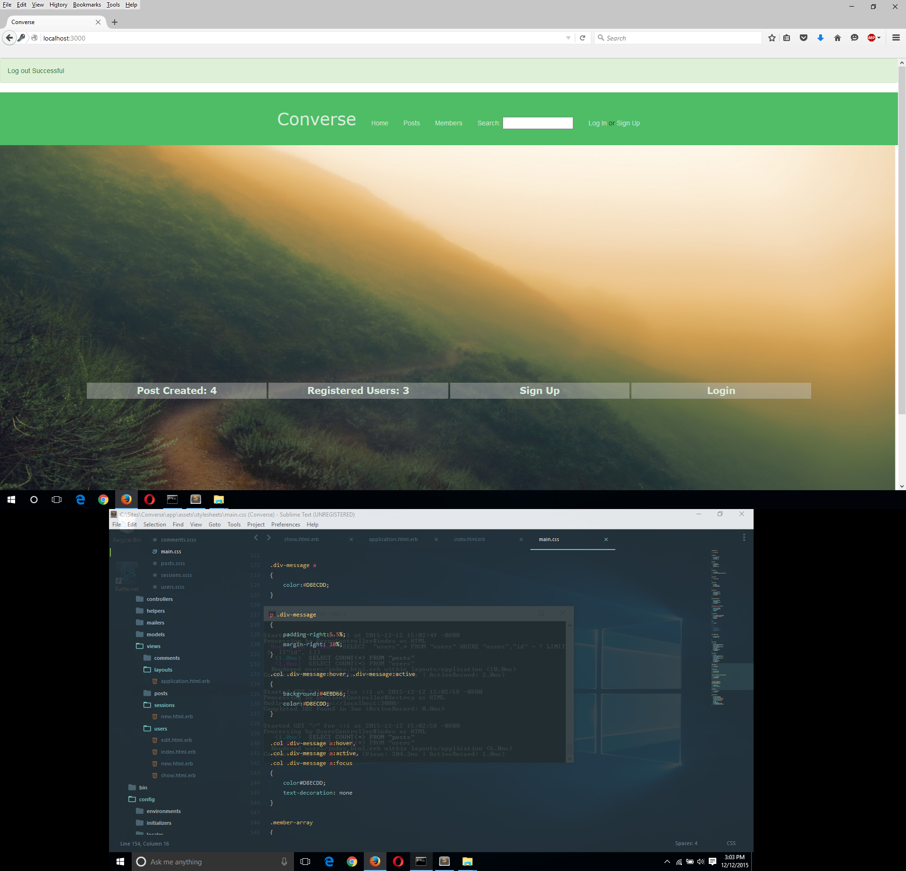
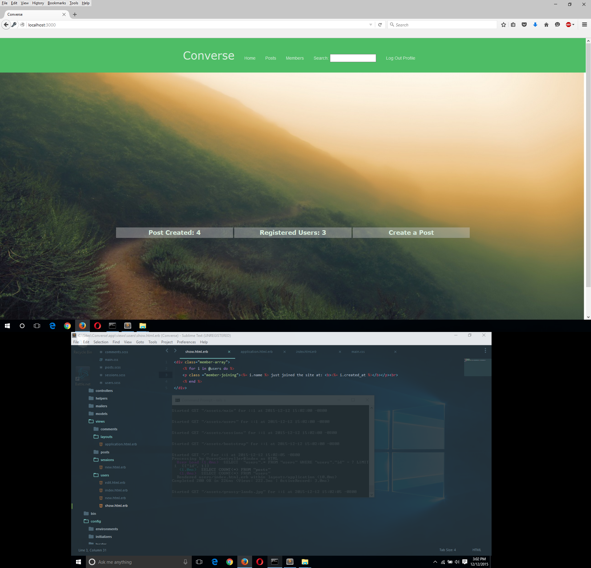

<h1></h1>  

<b>Converse is a forum based web application currently in production

  So far everything is almost done on the backend; however, judging from the pictures below we need to work on the front-end of the site. 

  We plan to do this by improving the UI/UX of the app by using existing web responsive frameworks, or building it from scratch ourselves.

<h2>The following are screenshoots of homepage and user profile</h2>

    
    
    
    
    

