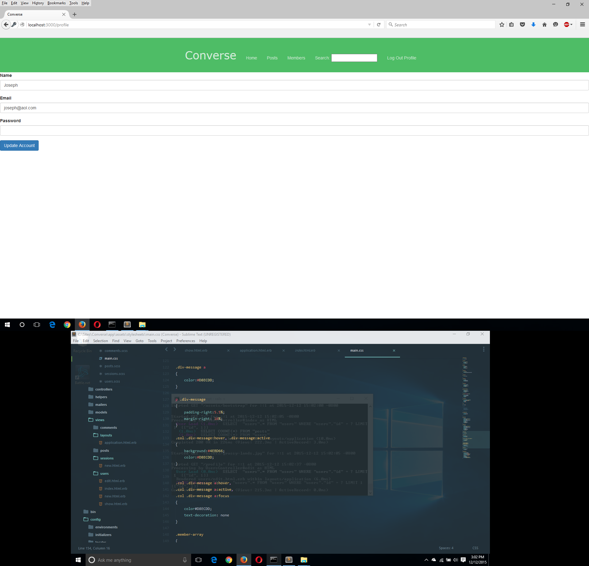
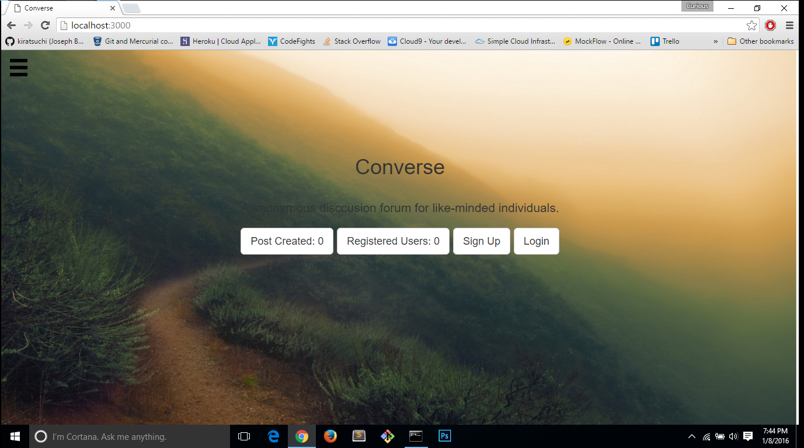
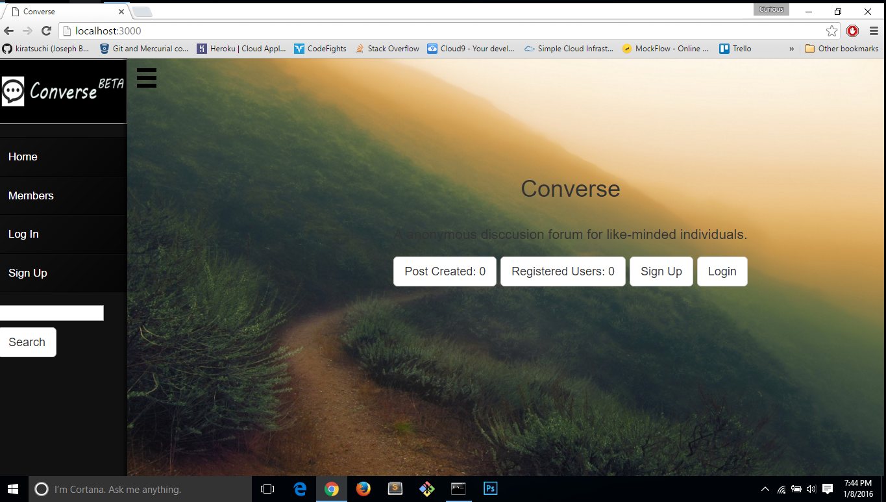
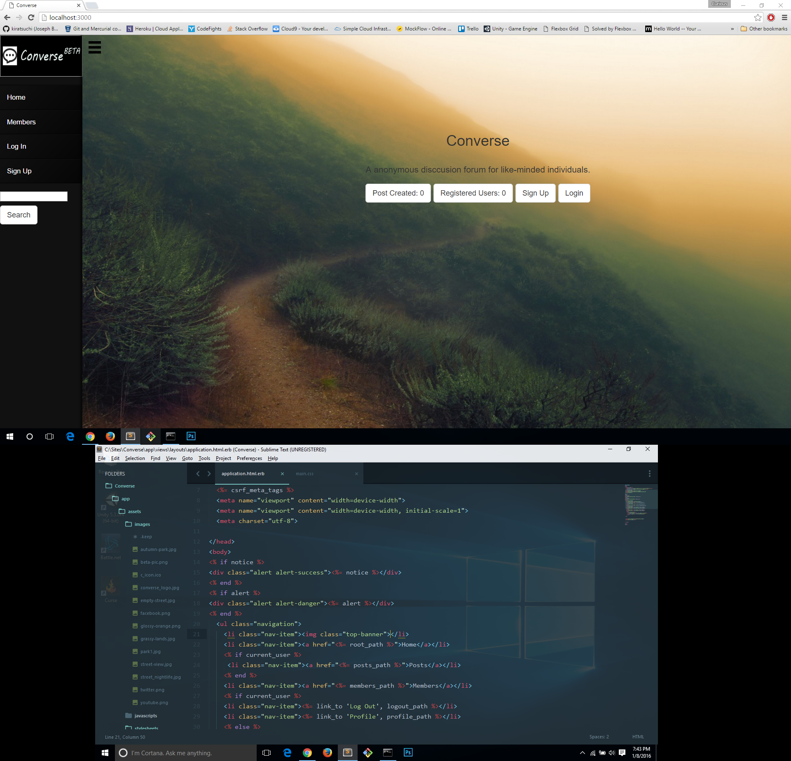

<h1></h1>  

<h2>Progress Report</h2>

<b>Converse is a ruby on rails web application that allows users to create a post and comment on post. Much like a forum-based web application, but with a twist. Users will be able to monetize from their posts, and donate via Bitcoin or paypal to other users. In Addition, created post that receive monetization awards will be split and allocated to post creator and users who commented on post.</b>

  So far everything is almost completed on the backend; however, there is still much improvements needed for the front-end of the site. 

  We also plan to improve the UI/UX of the app by using existing web responsive frameworks, or building it from scratch ourselves.

<h2>Getting Started</h2>

When will deploy the site either on heroku or digital ocean. Please create an account, share your post on social media, and bookmark us. We want our application to benefit the users as much as us, so we're re-thinking our strategy on how users will interact on our application.

<h2>Contributing</h2>

You can contribute towards the project on github, or contact us because we will be on the lookout for hiring mobile app engineer to produce iphone/android app for our app.

<h2>The following are screenshoots of homepage has been updated as of Jan, 8, 2016. The old picture are still in directory.</h2>

    
    
    
    
    

